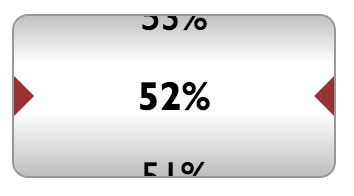

# jquery-wheel-gauge

A jQuery plugin for displaying a values in a more retro way.



## How to use

This plug-in works on input elements. To use it in your project, just include the `rundial.min.js` and `rundial.css`:

```html
    <script type="text/javascript" src="rundial.min.js"></script>
    <link rel="stylesheet" href="rundial.css" />
```

Put an input element where you want your dial to appear:

```html
    <input type="text" class="gauge-styling" id="mydial" />
```

And call `.rundial()` on that element:

```javascript
    $("#mydial").rundial({ .. options .. });
```

## Options Reference

The rundial function accelts a javascript object with the following basic properties:

  * __min__ : The minimum value range. _(default: 0)_
  * __max__ : The maximum value range. _(default: 100)_
  * __width__ : The width of the gauge. _(default: 'auto')_
  * __height__ : The height of the gauge. _(default: 'auto')_
  * __step__ : The interval between displayed values. _(default: 1)_
  * __value__ : The default value for the dial. _(default: [min])_

And the following advanced properties: 

  * __dampValue__ : The damping scale for the easing animation _(default: 10)_
  * __updateDelay__ : How frequently to poll the value of the input element for changes. Set to 0 to disable polling. _(default: 0)_
  * __format__ : The formatter function to use for the displayed values. _(default: `function(v){ return String(v); }`)_
  * __overflowText__ : The value to display when the text is overflowing. _(default: '(!)')_
  * __overflowElmClass__ : The class to append to the value element that displays the `overflowText`. _(default: 'rundial-warn')_
  * __overflowClass__ : The class to append to the whole rundial element when an overflow occurs. _(default: 'rundial-overrun')_
  * __underflowText__ : The value to display when the text is underflowing. _(default: '(!)')_
  * __underflowElmClass__ : The class to append to the value element that displays the `underflowText`. _(default: 'rundial-warn')_
  * __underflowClass__ : The class to append to the whole rundial element when an underflow occurs. _(default: 'rundial-underrun')_
  * __adoptClasses__ : Set to `true` to adopt the classes the input element had before being replaced by the rundial. _(default: true)_
  * __ascending__ : Switch order to ascending. _(default: false)_

# License

This library is licensed under the MIT License:

    The MIT License (MIT)
    
    Copyright (c) 2014 Ioannis Charalampidis
    
    Permission is hereby granted, free of charge, to any person obtaining a copy
    of this software and associated documentation files (the "Software"), to deal
    in the Software without restriction, including without limitation the rights
    to use, copy, modify, merge, publish, distribute, sublicense, and/or sell
    copies of the Software, and to permit persons to whom the Software is
    furnished to do so, subject to the following conditions:
    
    The above copyright notice and this permission notice shall be included in all
    copies or substantial portions of the Software.
    
    THE SOFTWARE IS PROVIDED "AS IS", WITHOUT WARRANTY OF ANY KIND, EXPRESS OR
    IMPLIED, INCLUDING BUT NOT LIMITED TO THE WARRANTIES OF MERCHANTABILITY,
    FITNESS FOR A PARTICULAR PURPOSE AND NONINFRINGEMENT. IN NO EVENT SHALL THE
    AUTHORS OR COPYRIGHT HOLDERS BE LIABLE FOR ANY CLAIM, DAMAGES OR OTHER
    LIABILITY, WHETHER IN AN ACTION OF CONTRACT, TORT OR OTHERWISE, ARISING FROM,
    OUT OF OR IN CONNECTION WITH THE SOFTWARE OR THE USE OR OTHER DEALINGS IN THE
    SOFTWARE.


